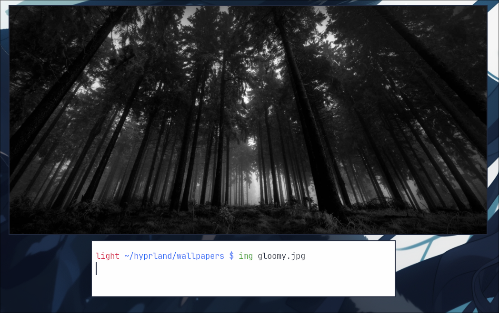

## img 🚀🦀
A lightweight CLI image viewer made with GTK4 and Rust. 🚀🦀 

## Installation

### GitHub Releases
See img's [releases page](https://github.com/nnyyxxxx/img/releases) for downloadable binaries.

## Building from source
1. Install Rust (preferably `rustup`) through your distro's package or [the official script](https://www.rust-lang.org/tools/install)
2. Install `git`, `pango` and `gtk4`
3. Clone this repository:
`git clone https://github.com/nnyyxxxx/img && cd img`
4. Compile the app with `cargo build --release` or run it directly with `cargo run --release`

## Credits:
- [Nyx](https://github.com/nnyyxxxx) - Making img, and maintaining the project.